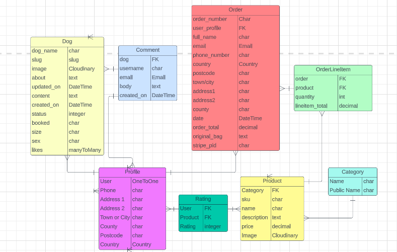
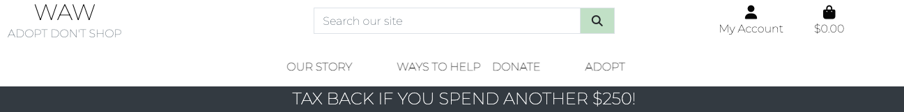
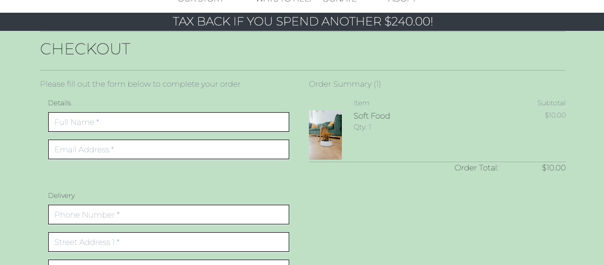

# **Wicklow Animal Welfare**

 

[💻Live Site](https://wicklow-animal-welfare.herokuapp.com/)

# **About**
 
This project had been designed to be a B2C e-commerce store to raise funds and supplies for a animal rescue charity. The products offered are for the consumer to donate food, toys or donations to the rescue through the site. It also has a section for dogs looking for homes, information on the charity and general useful information for those thinking of adopting or volunteering. This was added to further engage users in the product and as a site to visit to get information on the charity and what we do. These posts with dogs for adoption should be constantly updating and so inform the public through the marketing strategy.

This project was built as the final portfolio submission for the [Code Institute](https://codeinstitute.net/) Higher National Diploma in Full Stack Software Development. 

 

# **Contents**
* [**Business Model**](<#bussines-model>)
    *[**Marketing Strategy**](<#marketing-strategy>)
         *[SEO](<#seo>)
* [**Project**](<#project>)
    * [**Project Management**](<#project-management>)
        * [GitHub Project Board](<#github-project-board>)
        * [Database Schema](<#database-schema>)
* [**User Experience UX**](<#user-experience-ux>)
    * [**User Stories**](<#user-stories>)
        - [User](#users)
        - [User Unregister](#unregistered-user)
        - [User Register](#registered-user)
        - [User Staff](#staff-user)
    * [Site Structure](<#site-structure>)
    * [Colour Scheme](<#colour-scheme>)
    * [Typography](<#typography>)
    * [Flowcharts](#flowcharts)
        - [Flowchart Unregister User](#user-unregister-👇)
        - [Flowchart Registered User](#user-registered-👇)
        - [Flowchart Staff User](#user-staff-👇)
        - [Flowchart Others](#other-👇)
* [**Features**](<#features>)
        * [Sign-Up Page](<#sign-up-page>)
        * [Sign-In Page](<#sign-in-page>)
        * [Sign Out](<#sign-out>)
        * [Home Page](<#home-page>)
        * [Nav Bar](<#nav-bar>)
        * [Products Page](<#products-page>)
        * [Product Detail Page](<#fproduct-detail-page>)
        * [Edit Product Form](<#edit-product-form>)
        * [Delete Product](<#delete-product>)
        * [Product Management Form](<#product-management-form>)
        * [Shopping Bag Page](<#shopping-bag-page>) 
        * [Checkout Page](<#checkout-page>) 
        * [Checkout Success Page](<#checkout-success-page>) 
        * [Adoption Page](<#adoption-page>)
        * [Dog Detail Page](<#dog-detail-page>)        
        * [Edit Dog Form](<#edit-dog-form>)
        * [Delete Dog](<#delete-dog>)
        * [Dog Management Form](<#dog-management-form>)
        * [Profile Page](<#profile-page>)
        * [Dog Detail Page-Comments](<#dog-detail-page-comments>)  
        * [Edit Comments Page](<#edit-comments-page>)
        * [Search Results Page](<#search-results-page>)
        * [Footer](<#footer>)
    * [**Future Features**](<#future-features>)
* [**Testing**](<#testing>)
    * [**Validator Tests**](<#validator-tests>)
        * [W3C (HTML)](<#w3c-html>)
        * [W3C (CSS)](<#w3c-css>)
        * [ESLint (JavaScript)](<#eslint-javascript>)
    * [**Additional Tests**](<#additional-tests>)
        * [Manual Tests](<#manual-tests>)
        * [Input Validation Tests](<#input-validation-tests>)
        * [Automated Tests](<#automated-tests>)
        * [Responsive Tests](<#responsive-tests>)
        * [Browser Tests](<#browser-tests>)
        * [Lighthouse Tests](<#lighthouse-tests>)
    * [**Bugs**](<#bugs>)
        * [Resolved](<#resolved>)
        * [Unresolved](<#unresolved>)
* [**Technologies Used**](<#technologies-used>)
    * [Languages](<#languages>)
    * [Frameworks](<#frameworks>)
    * [Software](<#software>)
    * [Libraries](<#libraries>)
* [**Deployment**](<#deployment>)
    * [Project Deployment via Heroku](<#project-deployment-via-heroku>)
* [**Credits**](<#credits>)
    * [Content](<#content>)
    * [Media](<#media>)
    * [Code](<#code>)
*  [**Acknowledgements**](<#acknowledgements>)

# **Business Model**
 
The project had been based in Business to Consumer (B2C) style. It is an e-commerce where the consumer can find options to donate specific items to the charity.

 

## **Marketing Strategy**
 

### **SEO**
Several SEO techniques were undertaken in order to ensure the site ranks highly in search engine results. Also the files robots.txt and sitemap.xml had been included. The sitemap.xml file had been created using 

[xml-sitemap](https://www.xml-sitemaps.com/)

**Keywords:**
 
Starting with a brain storm of keywords that are relevant to the e-commerce itself. And reduced by making use of a word search so as to target the more relevant, the site I had used is 

[wordtracker](https://www.wordtracker.com/)

**Content marketing:**
 
The information and description of the products in the site had been kept the more relevant to the site purpose. Also the keywords had been taken into account when creating things like categories and such, so insure they are present without getting to be considered as spam. 
Each page has its own title, and finally meta tag description had been included in the base so that every page contains them.

**Social Media Marketing: Facebook**
 
The e-commerce has its own Facebook, the one that will keep posting a minimum of three times a week, and releasing alerts of monthly offers and benefits, which are sent by e-mail to the subscribers. This is for to motivate the subscription to our newsletter and increase the clients database.
 

 

 

**Email Marketing**
Users can join our mailing list.
 

 

[Back to top](<#contents>)

# Project

## Project Management

An agile methodology was used to plan and develop the Wicklow Animal Welfare project. All the main features of the application were recorded and refined into user stories. These user stories were created and stored as GitHub issues and then mapped into iterations to help to plan and allocate the workload. 

[Back to top](<#contents>)

### GitHub Project Board

All the user stories were added to a GitHub project board to assist with tracking progress. All user stories started in the to-do section. On completion, each user story was moved into the done section and marked as closed. 

[Click here to view the Project Board](https://github.com/users/lauralola/projects/7/views/1)

[Back to top](<#contents>)

### Database Schema

[Back to top](<#contents>)

# User Experience UX

As target users, we are aiming for individuals interested in animal welfare, adopting a dog or donating to the charity. The section with information on how to help also links to our products for sale. 

# User Stories

## **Users**

 
   
As a **user** I can **view a navbar from every page** so that **navigate easily between pages**

### Acceptance Criteria:
* Acceptance Criteria 1: A site wide nav bar component should be visible to the user from all pages of the site.
* Acceptance Criteria 2: The navbar should be accessible, intuitive and user friendly.
* Acceptance Criteria 3: All the main pages of the site should be visible on the navbar.
* Acceptance Criteria 4: Some pages should be hidden on the nav bar based on user logged in status.

### Tasks:
&check; Create navbar component
 
&check; Assign icons to logged in and logged out variables
 
&check; Add links and URLs 
 

As a **user** I can **view an ordered list of all the products** so that **I can browse through them**

### Acceptance Criteria:
* Acceptance Criteria 1: A 'Donate' link should be visible to users on the site nav bar
* Acceptance Criteria 2: When clicked, the user should be directed to the products page displaying a list of products to purchase

### Tasks:
&check; Add donate link to site nav bar
 
&check; Add product app
 
&check; Test functionality

As a **user** I can **view an ordered list of all the dogs** so that **I can browse through them**

### Acceptance Criteria:
* Acceptance Criteria 1: An 'Adopt' link should be visible to users on the site nav bar
* Acceptance Criteria 2: When clicked, the user should be directed to the dogs page displaying a list of dogs for adoption
### Tasks:
&check; Add adopt link to site nav bar
 
&check; Add dog app
 
&check; Test functionality

As a **user** I can **view details of the dogs, comments and likes** so that **I can know more about them**

### Acceptance Criteria:
* Acceptance Criteria 1: A link which when clicked can bring a detailed page of the selected dog 
* Acceptance Criteria 2: Likes and comments are visible on detailed page of the selected dog 

### Tasks:
&check; Add link to the homing page to bring to dog detail page
 
&check; Add dog detail template, URLs and views
 
&check; Test functionality

As a **user** I can **view details of the products** so that **I can know more about them and add to my bag**

### Acceptance Criteria:
* Acceptance Criteria 1: A link which when clicked can bring a detailed page of the selected product
* Acceptance Criteria 2: A link which when clicked adds selected product to bag

### Tasks:
&check; Add link to the product page to bring to product detail page
 
&check; Add product detail template, URLs and views
 
&check; Add bag app and link to add to bag
 
&check; Test functionality
 

As a **user** I can **add, edit and remove items from my bag** so that **I can adjust my bag**

### Acceptance Criteria:
* Acceptance Criteria 1: Separate links which when clicked can add, edit and delete items in bag
* Acceptance Criteria 2: Bag is updated and correct after adjustments

### Tasks:
&check; Add links to edit bag app
 
&check; Test functionality
 

As a **user** I can **checkout** so that **I can purchase items in my bag**

### Acceptance Criteria:
* Acceptance Criteria 1: Checkout link brings to checkout page
* Acceptance Criteria 2: Successful checkout sends confirmation email, order detail page, database order
* Acceptance Criteria 3: Interrupted checkout sends webhook to stripe

### Tasks:
&check; Set up checkout app, forms, templates etc
 
&check; Set up and connect stripe for checkout
 
&check; Set up and connect webhooks through stripe
 
&check; Test functionality
 

As a **user** I can **use a search bar to search the products list** so that **I can find a specific product quickly and easily**

### Acceptance Criteria:
* Acceptance Criteria 1: A search bar with a text input field should be visible to users on all pages
* Acceptance Criteria 2: When a user adds text to the search field the products list should be queried and products not matching the query should be filtered out and removed from view

### Tasks:
&check; Add search bar component with query method
 
&check; Import and add search bar component into header
 
&check; Add search method query into products list 
 
&check; Test functionality

## **Unregistered User**
 

As an **unregistered user** I can **clearly identify purpose of the page** so that **I can interact with the site**

### Acceptance Criteria:
* Acceptance Criteria 1: Clear landing page with links to further details

### Tasks:
&check; Add home app and links
 
&check; Test functionality
 

As an **unregistered user** I can **register for an account** so that **I can interact further with the site**

### Acceptance Criteria:
* Acceptance Criteria 1: A sign up button link should be visible to non-logged in users on the site nav bar
* Acceptance Criteria 2: Clicking the sign up button should direct the user to the sign up form page
* Acceptance Criteria 3: Successful sign up form submission should direct the user to the sign in page 

### Tasks:
&check; Add sign up button link to the nav bar
 
&check; Add conditional to button to only display if the user is logged out
 
&check; Add URL link to button to navigate to the DJ rest auth sign up url
 
&check; Add sign up form component with on change and on submit methods
 
&check; Add redirect to sign in page on successful submission
 
&check; Test functionality
 

## **Registered User**
 

As an **registered user** I can **sign in and out of my account** so that **I can interact further with the site**

## Acceptance Criteria:
* Acceptance Criteria 1: A log in and log out page link should be visible on the nav bar depending on status
* Acceptance Criteria 2: Clicking the link should direct the user to the log in or logout form page depending on status
* Acceptance Criteria 3: Filling in the form correctly should direct the user to the homepage and display their profile link in the navbar as well as the other pages only available to logged in users or redirect them to the homepage with a success message on log out

## Tasks:
&check; Add log in and log out page component
 
&check; Add conditional to only display to logged out users
 
&check; Add on change and on submit methods for log in and log out form
 
&check; Add route for log in and log out page component to app.js
 
&check; Add redirect to homepage on success
 
&check; Test functionality
 

As a **registered user** I can **add, edit and delete my own comments and likes to the dog posts** so that **I can interact with the site**

### Acceptance Criteria:
* Acceptance Criteria 1: When logged in I have access to comment and like a dog post
* Acceptance Criteria 2: When logged in, my own posts have edit and delete links that work

### Tasks:
&check; Add like and comment functionality to homing app
 
&check; Test functionality
 

As a **registered user** I can **edit my profile and see past orders** so that **I can change and update my profile and see past orders**

### Acceptance Criteria:
* Acceptance Criteria 1: A dropdown menu with a my profile link should be visible to the user
* Acceptance Criteria 2: The dropdown menu should only be visible if the user is logged in
* Acceptance Criteria 3: Clicking the profile button should direct the user to profile form page
* Acceptance Criteria 4: The form fields should be pre-populated with the data from the specific user if completed before
* Acceptance Criteria 5: Upon successful submission, the user should be redirected back to the updated profile page
* Acceptance Criteria 6: Past orders should be visible and update accordingly

### Tasks:
&check; Add dropdown menu component with profile button 
 
&check; Add URL to direct the user to profile
 
&check; Add conditional to only show dropdown menu if the user is logged in
 
&check; Add profile edit form component with on change and on submit methods
 
&check; Add user redirect to profile page on successful submit
 
&check; Add error handling and validation
 
&check; Test functionality
 

As a **registered user** I can **delete my account** so that **I can remove my profile and all its content from the platform instantly**

### Acceptance Criteria:
* Acceptance Criteria 1: A delete button should be visible within a user’s profile dropdown menu
* Acceptance Criteria 2: Clicking the delete button should display a pop up window prompting the user to confirm their request to delete their profile
* Acceptance Criteria 3: If a user clicks the delete button on the pop up their profile should be deleted along with all their content and they should be logged out and redirected back to the home page

### Tasks:
x Add delete button icon to profile page dropdown menu
 
x Add delete user/profile method
 
x Add pop up delete confirmation to confirm user deletion
 
x Add redirect to method on successful completion
 
x Test functionality

## **Staff User**
 

As **admin User** I want to **access to a staff panel** where I can **manage the store's database from**
   - Staff Panel page

As **Staff/Admin User** I want to be **able to manage the DB from the front-end**
   - Staff Panel page:
      - Add, update or delete Product Form
      - Add, update or delete a dog profile

 

As an **admin user** I can **add, edit and delete products** so that **I can keep the site up to date**

### Acceptance Criteria:
* Acceptance Criteria 1: An edit or delete icon button should be visible to a admin user in the product detail page and from the product management in my account drop down 
* Acceptance Criteria 2: This should only be visible if the user is admin 
* Acceptance Criteria 3: Clicking the edit or delete button should edit or delete the product and redirect the user back to the home page

### Tasks:
&check; Add edit and delete button link to the product detail page and product management drop down to my account area
 
&check; Add handle add, edit, delete methods
 
&check; Add user redirect to home page on successful task
 
&check; Add conditional to dropdown menu 
 
&check; Test functionality

As an **admin user** I can **add, edit and delete dogs** so that **I can keep the site up to date**

### Acceptance Criteria:
* Acceptance Criteria 1: An edit or delete icon button should be visible to a admin user in the dog detail page and from the dog management in my account drop down 
* Acceptance Criteria 2: This should only be visible if the user is admin 
* Acceptance Criteria 3: Clicking the edit or delete button should edit or delete the product and redirect the user back to the home page

### Tasks:
&check; Add edit and delete button link to the dog detail page and dog management drop down to my account area
 
&check; Add handle add, edit, delete methods
 
&check; Add user redirect to home page on successful task
 
&check; Add conditional to dropdown menu 
 
&check; Test functionality

As an **admin user** I can **delete users comments** so that **I can keep the site up to date**

### Acceptance Criteria:
* Acceptance Criteria 1: A delete icon button should be visible to a admin user in the comments section
* Acceptance Criteria 2: This should only be visible if the user is admin 
* Acceptance Criteria 3: Clicking delete button should delete the comment

### Tasks:
&check; Add delete button link to the comment section for admin user
 
&check; Add handle delete method
 
&check; Add user redirect on successful task
 
&check; Test functionality

[Back to top](<#contents>)

## Site Structure

The site structure for Wicklow Animal Welfare was kept simple and user-friendly to avoid confusion. The main site nav bar and is present on every page of the site to allow for easy access to site navigation. Non-authenticated users have limited access to pages within the site, and this is reflected in the changing state of the nav menus. Non logged in users only have access to certain areas and log-in / sign-up auth pages are clearly labelled. Authenticated users can access commenting, liking and their profile page with admin users able to change the database on the front end. 

[Back to top](<#contents>)

## Colour Scheme

The colour scheme was kept simple with gray and pale green mostly used and pops of colour from the images through the site. 

[Back to top](<#contents>)

## Typography

Wicklow Animal Welfare uses [Google Fonts](https://fonts.google.com/) for its typography. The font utilised is Montserrat.

[Back to top](<#contents>)

# Features

### Sign-Up Page

The sign-up page was created to allow users to register their details and sign-up for an account. On successful form submission the user is redirected to the sign in page to sign into their new account.

[Back to top](<#contents>)

### Sign-In Page

The sign-in page was created to allow users to sign into their account to access features. On successful form submission, the user is redirected to the homepage.

[Back to top](<#contents>)

### Sign Out

The sign-out functionality doesn't have its own page. The user simply clicks the sign out button in one of the nav menus and they are signed out of their account and redirected back to the home page.

[Back to top](<#contents>)

### Home Page

The homepage features the a striking image and links to access our donation page, also some basic information about the rescue and links about donating, adopting and volunteering with some information. Links in the nav bar link directly to these sections within the home page.

[Back to top](<#contents>)

### Nav Bar

The nav bar handles the main site menu. It is available on all pages and contains all links to pages across the site. 

[Back to top](<#contents>)

### Products Page

The products page is available to view for both authenticated and non-authenticated users. The page features a list of all the products currently on the site with their prices and image. The list  can be ordered by price, category and rating. Clicking on the image of a product will open the detail on that product. Logged in users can also leave a star rating here. 

[Back to top](<#contents>)

### Product Detail Page

The product detail page is available to view for both authenticated and non-authenticated users. Clicking on the image of a production the main page will open the detail on that product. This displays more information and an area to add the product to the bag. A success message confirming this is given if added or updated here. 

[Back to top](<#contents>)

### Edit Product Form

The edit product form is only accessible to admin users who are authenticated. Clicking the edit icon next to the product directs the user to the form to edit the details for this product prefilled with the text already present. An alert is also displayed to the user that they are editing this product. Changing the fields and submitting the form directs the user back to the product page for this product with the details changed and a success message. Clicking the cancel button returns the user to the product page with no changes made. Issues with submitting an incorrectly filled form will raise an alert box to tell the user the form was not submitted or saved.  

[Back to top](<#contents>)

### Delete Product

The delete product is available to authenticated admin users. There is no page for deletion. The user simply clicks the delete icon and it is removed. A success message is given to let the user know the item has been deleted. 

[Back to top](<#contents>)

### Product Management Form

The product management form is only available to authenticated users via their account tab. If non-authenticated users try to access this page they are redirected to the home page. The page features the blank product form. On successful submission, the user is redirected to the product page with the new product visible as a card. If the user clicks the cancel button they are returned to the previous page they were on. 

[Back to top](<#contents>)

### Shopping Bag Page

The shopping bag page opens when the bag icon on the top right of the screen is clicked. This will also inform user of the total cost of the shopping bag. If the bag is empty the user is informed and directed back to the shopping area. Any items added to the bag will be displayed with the details of their cost, quantity and total with buttons to edit or delete the items. Tax back is available for donations over $250 and the user is informed of this. From the bag the user is able to go to the checkout area. 

[Back to top](<#contents>)

### Checkout Page

The user is asked to complete a form with their details and an order summary is displayed. They can save the details completed to their profile by leaving the box for this checked. The user is asked for their card details. A warning that their card will be charged the amount displayed is given before the complete order button. If user information has not been correctly completed in the correct format the user is redirected back to this section of the page to rectify. If submitted successfully the user is directed to the checkout success page. 

[Back to top](<#contents>)

### Checkout Success Page

This page displays an order summery and order number for the user. Email confirmation is also provided. 

[Back to top](<#contents>)

### Adoption Page

The adoption page is available to view for both authenticated and non-authenticated users. The page features a list of all the dogs currently on the site for adoption with their image, sex, name and date created. Clicking on the image of a dog will open more detail on the dog. 

[Back to top](<#contents>)

### Dog Detail Page

The dog detail page is available to view for both authenticated and non-authenticated users. Clicking on the image of a dog in the main page will open the detail on that dog. The page features more information on the dog with comments and likes visible. Only logged in users have access to comment or like. Users must be logged in to comment or like and are alerted to this if not. Once logged in users can like and unlike, comment and edit or delete their own comments. 

[Back to top](<#contents>)

### Edit Dog Form

The edit dog form is only accessible to admin users who are authenticated. Clicking the edit icon next to the dog directs the user to the form to edit the details for this dog prefilled with the text already present. An alert is also displayed to the user that they are editing this. Changing the fields and submitting the form directs the user back to the dog page with the details changed and a success message. Clicking the cancel button returns the user to the dog page with no changes made. Issues with submitting an incorrectly filled form will raise an alert box to tell the user the form was not submitted or saved.  

[Back to top](<#contents>)

### Delete Dog

The delete dog is available to authenticated admin users. There is no page for deletion. The user simply clicks the delete icon and it is removed. A success message is given to let the user know it has been deleted. 

[Back to top](<#contents>)

### Dog Management Form

The dog management form is only available to authenticated users via their account tab. If non-authenticated users try to access this page they are redirected to the home page. The page features the blank dog form. On successful submission, the user is redirected to the homing page with the new dog visible as a card. If the user clicks the cancel button they are returned to the previous page they were on. 

[Back to top](<#contents>)

### Profile Page

The user profile page is only visible to authenticated users. Here any saved information is displayed and can be edited and details of previous orders are visible. Details can be edited and updated by completing and selecting the update tab. A success message will appear is correct. Orders can also be opened from here by selecting the order number to see more details on the order. 

[Back to top](<#contents>)

### Dog Detail Page - Comments

 

* At the bottom of detailed page, users can read the comments posted by other users. If the user is logged in or is a superuser they have access to the buttons for deleting or updating comments. If the comment field is left blank and submit clicked the user is prompted to fill in the field. 

[Back to top](<#contents>)

### Edit Comments Page

* If a user is logged in they can click a link beside their own comments and they are allowed to add, edit or delete their own comments. The website superuser can delete or update any comments without having to access the admin panel.

[Back to top](<#contents>)

### Search Results Page

* A user can user the search bar tool to find relevant products. They are displayed below a message informing the user that if not results found please try another. If the user clicks the search button on an empty enquiry they will be informed that they forgot to search. This currently just searches products but a future feature could be to search all apps. 

[Back to top](<#contents>)

### Footer

* The footer contains links to our facebook page and to subscribe to our newsletter. 

[Back to top](<#contents>)

### 404 Page

The 404 page is triggered when a user navigates to a site URL which doesn't exist. This could be because of a number of reasons, including a faulty link or an expired URL. Most users will not see this page, but it is there as a backup for users who encounter these rare errors. The purpose of the 404 page is to notify the user that there has been an error, and the page that they have tried to access cannot be found.

[Back to top](<#contents>)

## Future Features

1. Further functionality to search the site. 

2. A user could have the functionality to completely delete their account along with any related content. 

3. An events section could be added so users can fundraising events.

4. Rating section could be further implemented to use the average rating correctly.

[Back to top](<#contents>)

# Testing

## Validator Tests

### W3C HTML

All the pages of the site have been passed through the [W3C HTML Markup Validation Service](https://validator.w3.org/), with minor errors rectified. No errors or warnings are now showing.

[Back to top](<#contents>)

### W3C CSS

This file was passed through the [Jigsaw W3C CSS Validation Service](https://validator.w3.org/).

[Back to top](<#contents>)

### ESLint Javascript

All JavaScript files in the project have been run through the [JavaScript ESLinter](https://eslint.org/). 

[Back to top](<#contents>)

### Flake8

Flake8 errors recticied, apart from one or too lines to long that caused the code not to run correctly when rectified. 

### Manual Tests

# **Responsiveness**
<bt>

The site had been test for the following devices:

Mobile: 360 * 640 / 390 * 844 / 414 * 896

Tablet: 768 * 1024 / 820 * 1180 / 1366 * 768

Monitor: 1280 * 1024 / 1600 * 900 / 1950 & UP

The site had been test in Chrome seeming all according to the design. In Firefox. In Internet Explorer all seems to work as the design.
 

## **Navbar**

**Users**
 
| Feature       | Expected           | Action| Result|
| ------------- |:-------------| :-----|-----:|
| Logo     | Directs to the landing/index page | Click |✅|
| My Account Icon     | Dropdown allauth options menu | Click |✅|
| Sign Up     | Directs to Sign Up Form | Click |✅|
| Sign In     | Directs to Sign In Form | Click |✅|
| Sign Out     | Directs to Sign Out Form | Click |✅|
| Shopping Cart Icon | Directs to the shopping cart page | Click |✅|
| Shopping Cart Amount | Display the total of the shopping cart | Click |✅|
| Toggle Menu Icon - Small devices     | Dropdown menu options | Click |✅|
| Our Story | Directs to the home page, story section| Click |✅|
| Ways to help dropdown| Each directs to the ways to help section | Click |✅|
| Donate | Directs to the products section organised by dropdown choice| Click |✅|
| Adopt | Directs to the homing page| Click |✅|
| Search | Render products according to user's input | Click |✅|
 

**Register User**
 

| Feature       | Expected           | Action| Result|
| ------------- |:------------- | :-----|-----:|	 	
| My Profile     | Directs to the request user profile page | Click |✅|
| Sign Out     | Directs to Sign Out Form | Click |✅|
 

**Staff User**
 

| Feature       | Expected           | Action| Result|
| ------------- |:------------- | :-----|-----:|	 	
| Dog/Product Management    | Directs to these pages | Click |✅|
| Sign Out     | Directs to Sign Out Form | Click |✅|
 

## **Messages**
**Users**
 
| Feature       | Expected           | Action| Result|
| ------------- |:------------- | :-----|-----:|
| Message in top right of screen     | Floating message according to the user action | Triggered by user action |✅|
 

## **Footer**
**Users**
 
| Feature       | Expected           | Action| Result|
| ------------- |:-------------| :-----|-----:|
| Subscribe Newsletter Form | Feedback to user | On Submit button |✅|
| Subscribe Newsletter - Success | If user subscription went successful | Response to form action |✅|
| Subscribe Newsletter - Fail | If user subscription failed | Response to form action |✅|
| Facebook | Directs to e-commerce's Facebook in new tab | Click |✅|
 

## **Home Page**

**Users**
 
| Feature       | Expected           | Action| Result|
| ------------- |:-------------| :-----|-----:|
| Donate Now Button     | Brings user to products page | Click on |✅|
| Links in ways to help    | Link to correct pages | - |✅|
 

## **Store Page**

**Users**
 
| Feature       | Expected           | Action| Result|
| ------------- |:-------------| :-----|-----:|
| Sorting selections       | Sort by the selected filter| - |✅|
| Products Cards | When clicked bring user to correct product detail | Click |✅|
| Star Rating | When clicked saves users rating | Click |Not functioning correctly as does not save on reload or update average|
 

## **Product Details Page**

**Users**
 
| Feature       | Expected           | Action| Result|
| ------------- |:-------------| :-----|-----:|
| Keep Shopping  Button       | Directs to Product page  | Click |✅|
| Add To Cart Button       | Add the product to the shopping cart  | Click |✅|
| Quantity      | Changes quantity to add to bag  | Click |✅|
 

**Staff User**
 
| Feature       | Expected           | Action| Result|
| ------------- |:-------------| :-----|-----:|
| Edit Product Button       | Open the form to edit  | Click |✅|
| Delete Product Button       | Confirm the product to be delete  | Click |✅|
 

## **Adopt Page**

**Users**
 
| Feature       | Expected           | Action| Result|
| ------------- |:-------------| :-----|-----:|
| Dog Likes/comments | Display number of likes and comments on correct dog profile | - |✅|
| Pagination    | Display according to the page the user is in, it would show prev or next plus
||  a set of pages | - |✅|
| Dog Cards | When clicked bring user to correct dog profile | Click |✅|
 

 

## **Dog Details Page**

**Registered Users**
 
| Feature       | Expected           | Action| Result|
| ------------- |:-------------| :-----|-----:|
| Comment and like sections       | Can add comments and likes to dog profile  | Click |✅|
| Edit own comments       | Can edit user comments  | Click |✅|
| Cannot edit or delete others comments       | If try message pops up  | Click |✅|
| Delete own comments       | Can delete own comments| Click |✅|
 

**Unregistered Users**
 
| Feature       | Expected           | Action| Result|
| ------------- |:-------------| :-----|-----:|
| Prompted to create account to add comment and like sections       | Brings to sign up page  | Click |✅|

**Staff User**
 
| Feature       | Expected           | Action| Result|
| ------------- |:-------------| :-----|-----:|
| Edit Dog Button       | Open the form to edit  | Click |✅|
| Delete Dog Button       | Confirm to be deleted  | Click |✅|
| Can edit or delete all comments       | Brings to correct section to edit/delete  | Click |✅|
 

## **Staff Pages**

**Staff Users**
 
| Feature       | Expected           | Action| Result|
| ------------- |:-------------| :-----|-----:|
| Dog Management Button   | Directs to a form page for adding dog  | Click |✅|
| Product Management Button   | Directs to a form page for adding product | Click |✅|
 

### **Staff Forms**
 

| Feature       | Expected           | Action | Result |
| ------------- |:-------------| :-----|-----:|
| Add Product or Dog Forms   | Save and trigger message  | Click |✅|
| Edit Product or Dog Form   | Save and trigger message  | Click |✅|
| Delete Product or Dog Form   | Delete and trigger message  | Click |✅|
 

## **Shopping Cart**

**Users**
 
| Feature       | Expected           | Action| Result|
| ------------- |:-------------| :-----|-----:|
| Remove  | Remove the item from the shopping cart | Click |✅|
| Update Qty | Modify the quantity of the item as user's input | Click |✅|
| Keep Shopping Link | Returns the user to the store | Click |✅|
| Secure Checkout Link | Directs to the Checkout Form page | Click |✅|
 

## **Checkout Page**

**Unregister Users**
 
| Feature       | Expected           | Action| Result|
| ------------- |:-------------| :-----|-----:|
| Form to fill  | Form with required fields, validate | - |✅|
| Payment fields  | Form with required fields, validate | - |✅|
| Adjust Cart Link | Returns the user to the shopping cart | Click |✅|
| Complete Order Link | Directs to the Checkout Success page if successful | Click |✅|
 

**Register Users**
 
| Feature       | Expected           | Action| Result|
| ------------- |:-------------| :-----|-----:|
| Form to review, prefill  | Form filled with profile user's data, validate required fields | - |✅|

**Backend/Admin Panel**
 
* All the models working to create, delete and update and perform as expected.  

[Back to top](<#contents>)

## Bugs

* Several bug were fixed throughout the testing process. Buttons were displaying with an overlap on small screen sizes which was due to an error with the bootstrap used. There was an issue with the messages not popping up. This was discovered to be related to the mailchimp javascript and was resolved when this was moved to the footer template rather than the base template. 

* The shopping bag was allowing the decrement buttons to select minus amount of product. When updated this just removes the item from the bag so is not affecting checkout. This was fixed.

* Issues with adding rating functionality need further work. Logged in users can leave a rating, however this is not saved and does not change average rating. As this was not key to website and due to timing issues this was not rectified.

* Issue with webhooks was found to be due to an error in the WH secret key. 

[Back to top](<#contents>)

# Technologies Used

### Languages Used

* HTML
* CSS
* JavaScript
* Django
* Python

#### Django Packages

* Gunicorn
* Cloudinary
* DJ-database-url
* Pyscopg2 
* Summernote 
* Allauth 
* Crispy Forms 

### Frameworks - Libraries - Programs Used

* Git, Gitpod and Github
* Heroku
* ElephantSQL
* Fontawesome
* Google Chrome Dev Tools
* Google Fonts
* Lucidchart
* Lucidspark

[Back to top](<#contents>)

# Deployment

## Creating the Django app

1. Go to the Code Institute Gitpod Full Template [Template](https://github.com/Code-Institute-Org/gitpod-full-template)
2. Click on Use This Template and click Gitpod
3. Install Django and gunicorn: `pip3 install 'django<4' gunicorn`
4. Install supporting database libraries dj_database_url and psycopg2 library: `pip3 install dj_database_url==0.5.0 psycopg2`
5. Create file for requirements: in the terminal window type `pip freeze --local > requirements.txt`
6. Create project: in the terminal window type django-admin startproject your_project_name
7. Create app: in the terminal window type python3 manage.py startapp your_app_name
8. Add app to the list of installed apps in settings.py file: you_app_name
9. Migrate changes: in the terminal window type python3 manage.py migrate
10. Run the server to test if the app is installed, in the terminal window type python3 manage.py runserver
11. If the app has been installed correctly the window will display The install worked successfully! Congratulations!

## Deployment of This Project

1. Log in to [Heroku](https://id.heroku.com) and select New in the top right corner and Create New App from dropdown. 
2. Create app name and select region and create app
3. Create a database on ElephantSQL by logging in and creating a new instance. Give your plan a name and select the Tiny Turtle (Free) plan. Select region and datacentre, click review and create instance. 
4. Return to the ElephantSQL dashboard and click on the database instance name for this project. In the URL section, click the copy icon to copy the database URL. 
5. In your project workspace, create a file called env.py and ensure this file is in your gitignore.
6. Add env.py file to your settings.py. Further down your settings.py file remove the insecure secret key provided by Django and replace with `SECRET_KEY = os.environ.get('SECRET_KEY')`. Replace database in settings with `DATABASES = {'default': dj_database_url.parse(os.environ.get("DATABASE_URL"))}`. Add secret key and database information to env.py file and migrate changes. 
7. Create a cloudinary account and copy your API authentication information. Add this to your env.py file under `CLOUDINARY_URL`. Add cloudinary libraries to settings.py file. Also add `STATICFILES_STORAGE` with `Cloudinary_storage.storage.StaticHashedCloudinaryStorage` and use `os.path.join` to connect our base directory to static and set up static route. Do the same for media URL with `Cloudinary_storage.storage.MediaCloudinaryStorage`.
8. Create a stripe account and copy the Publishable Key and add it as variable to the env.py and set the variable for it in settings. Repeat with Secret Key.
9. Click on webhooks in stripe and "Add Endpoint". Follow the instructions to add the url + '/checkout/wh'. Select the listener events and save it. Repeat step 8 with this new key, the STRIPE_WH_SECRET variable. These 3 keys will go into Heroku config vars.
10. At the top of settings.py and under the base directory add `TEMPLATES_DIR =  os.path.join(BASE_DIR, 'templates')` and change the D-I-R-S key in template setting to point towards the new templates directory variable. 
11. Add Heroku host name into allowed hosts in settings.py file. Also add localhost. 
12. Create a Procfile `web: gunicorn your_project_name.wsgi`
13. Go back to Heroku and open settings tab. Reveal Config Vars and add a new record with SECRET_KEY, a new record with the `CLOUDINARY_URL` a new record with the `DISABLE_COLLECTSTATIC = 1`, a new record with the DATABASE_URL, PORT set to 8000.
14. Select Github as the deployment method and confirm you want to connect to GitHub
15. Search for the repository name and click the connect button
16. Scroll to the bottom of the deploy page and select the preferred deployment type
17. Click either Enable Automatic Deploys for automatic deployment when you push updates to Github

## Final Deployment 

1. Create a runtime.txt `python-3.8.13`
2. When development is complete change the debug setting to: `DEBUG = False` in settings.py
3. In this project the summernote editor was used so for this to work in Heroku add: `X_FRAME_OPTIONS = SAMEORIGIN `to settings.py.
4. In Heroku settings, delete the config vars for `DISABLE_COLLECTSTATIC = 1`

[Back to top](<#contents>)

# Credits

## Media

* Image content was acquired from [Pexels](https://www.pexels.com/)

* SEO advice from [Wix](https://www.wix.com/seo/learn/resource/on-page-seo-for-smbs)

* Keywords advice from [Wordtracker](https://www.wordtracker.com/)

* External reference advice from [Wordstream](https://www.wordstream.com/blog/ws/2013/07/24/follow-nofollow-links#:~:text=What%20is%20a%20No%20Follow,follow%20links%20get%20no%20love.)

* Rating functionality advice from [Medium] (https://medium.com/geekculture/django-implementing-star-rating-e1deff03bb1c) and 
[CodingLab] https://www.youtube.com/watch?v=q1xhbc-oKnc&ab_channel=CodingLab

[Back to top](<#contents>)

## Code

* Code Institute's Boutique Ado walkthrough project was used as a guide. 

[Back to top](<#contents>)
